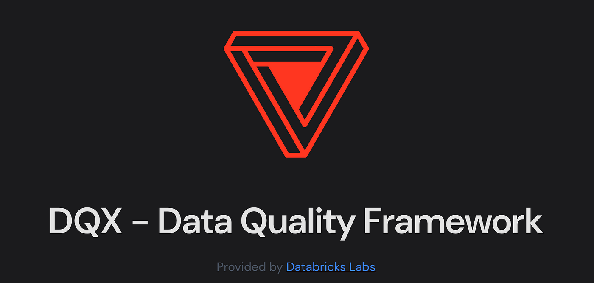
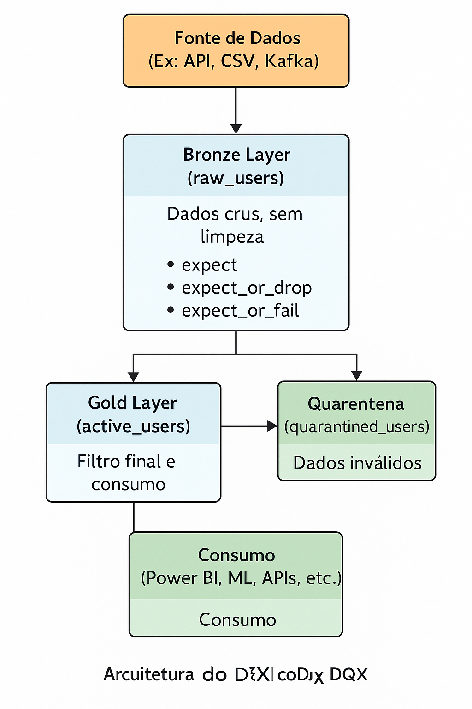

# dqx_data_quality_framework-databricks

## Visão Geral
O processo de tomada de decisão está diretamente ligado à qualidade dos dados fornecidos para os diversos tipos de análise. A utilização de dados incompletos, inconsistentes ou sisplesmente incorretos pode gerar grandes prejuízos para as empresas e gerar cenários comprometedores para o negócio.
O Databricks DQX pode nos ajudar a superar esse problema em pipelines criados na própria ferramenta, através de regras de validação automáticas e monitoramento personalizado para todas as camadas de dados.
O Databricks DQX é uma funcionalidade projetada para realizar o gerenciamento de qualidade dos dados por meio de regras de validação de Data Frames e Streams através do uso do Apache Spark, nos permitindo obter indicadores de qualidade como Integridade, Completude e Consistêcia, que, por sua vez, são muito importantes para garantirmos o sucesso no processo de tomada de decisão utilizando grandes volumes de dados.
## Objetivos
1. Definir Regras de Qualidade de Dados (Expectations):
- Permite definir regras declarativas para validar os dados, como por exemplo:
- Valores não nulos (expect(col("id").isNotNull(), "ID must not be null"))
- Faixas válidas (expect(col("age") > 0, "Age must be positive"))
- Conformidade com formatos ou padrões específicos
#
2. Monitorar Conformidade com as Regras:
- Avalia automaticamente se os dados cumprem as regras definidas e gera métricas sobre:
- Porcentagem de linhas válidas
- Quantidade de falhas por expectativa
- Tendências ao longo do tempo
#
3. Tratar Linhas Inválidas com Ações Customizadas:
- Permite configurar o que fazer com os dados inválidos:
- fail: interrompe o pipeline se houver falhas
- drop: descarta linhas que violam a regra
- quarantine: envia para uma tabela separada para análise posterior
#
4. Aumentar a Confiabilidade do Pipeline de Dados:
- Ao aplicar regras de qualidade automaticamente durante o processamento, o DQX ajuda a evitar que dados corrompidos ou incompletos contaminem os resultados finais.
#
5. Auditoria e Transparência:
- As expectativas aplicadas são registradas nos event logs e podem ser auditadas. Isso aumenta a rastreabilidade do pipeline.
#
6. Facilidade de Implementação (Code-first ou UI):
- O DQX pode ser configurado tanto via código em Python com DLT quanto visualmente pela interface do Databricks.
## Tecnologias
- DQX
## Arquitetura
- Governança de dados: Centraliza controle de qualidade e rastreabilidade
- Observabilidade: Métricas e logs sobre conformidade com DQX
- Flexibilidade: Fácil adaptação a novas regras sem reescrever o pipeline inteiro
- Escalabilidade: Ideal para cenários de dados em larga escala com DLT autogerenciado

## Documentações Utilizadas
Link
#
#
#
# dqx_data_quality_framework-databricks

## Overview
The decision-making process is directly linked to the quality of the data provided for the different types of analysis. The use of incomplete, inconsistent or simply incorrect data can cause major losses for companies and create compromising scenarios for the business.
Databricks DQX can help us overcome this problem in pipelines created in the tool itself, through automatic validation rules and personalized monitoring for all data layers.
Databricks DQX is a functionality designed to manage data quality through Data Frames and Streams validation rules through the use of Apache Spark, allowing us to obtain quality indicators such as Integrity, Completeness and Consistency, which, in turn, are very important to ensure success in the decision-making process using large volumes of data.