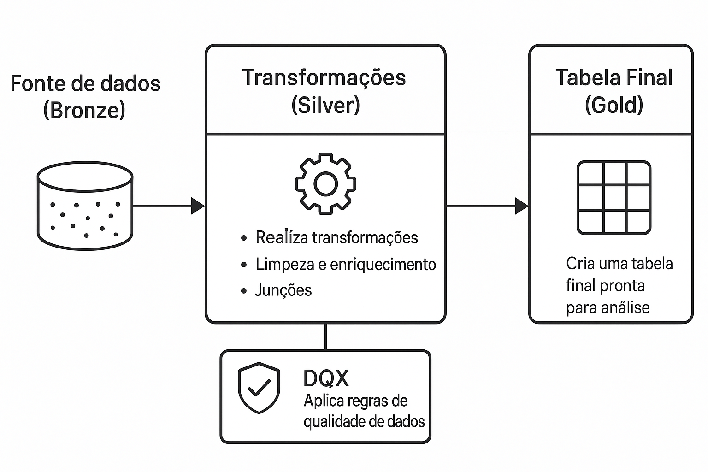

## Visão Geral
O processo de tomada de decisão está diretamente ligado à qualidade dos dados fornecidos para os diversos tipos de análise. A utilização de dados incompletos, inconsistentes ou sisplesmente incorretos pode gerar grandes prejuízos para as empresas e gerar cenários comprometedores para o negócio.
O Databricks DQX pode nos ajudar a superar esse problema em pipelines criados na própria ferramenta, através de regras de validação automáticas e monitoramento personalizado para todas as camadas de dados.
O Databricks DQX é uma funcionalidade projetada para realizar o gerenciamento de qualidade dos dados por meio de regras de validação de Data Frames e Streams através do uso do Apache Spark, nos permitindo obter indicadores de qualidade como Integridade, Completude e Consistêcia, que, por sua vez, são muito importantes para garantirmos o sucesso no processo de tomada de decisão utilizando grandes volumes de dados.
## Objetivos
Construir um pipeline de dados com Delta Live Tables que:
- Lê dados brutos de uma fonte (bronze)
- Realiza transformações (silver)
- Aplica regras de qualidade de dados com DQX
- Cria uma tabela final (gold) pronta para análise
## Tecnologias
- Delta Live Tables (DLT) e Data Quality Expectations (DQX)
## Arquitetura
Este projeto demonstra um pipeline com Delta Live Tables (DLT) utilizando DQX (Data Quality Expectations) para garantir integridade dos dados.
#
1. Camadas
- **Bronze**: ingestão dos dados brutos
- **Silver**: limpeza e validação com DQX
- **Gold**: agregações e métricas
#
2. Qualidade dos Dados
- `order_id` não pode ser nulo
- `total_amount` deve ser ≥ 0 (linhas inválidas são descartadas)
- `order_date` não pode ser nulo
#

## Documentações Utilizadas
Link
#
#
#

## Overview
The decision-making process is directly linked to the quality of the data provided for the different types of analysis. The use of incomplete, inconsistent or simply incorrect data can cause major losses for companies and create compromising scenarios for the business.
Databricks DQX can help us overcome this problem in pipelines created in the tool itself, through automatic validation rules and personalized monitoring for all data layers.
Databricks DQX is a functionality designed to manage data quality through Data Frames and Streams validation rules through the use of Apache Spark, allowing us to obtain quality indicators such as Integrity, Completeness and Consistency, which, in turn, are very important to ensure success in the decision-making process using large volumes of data.